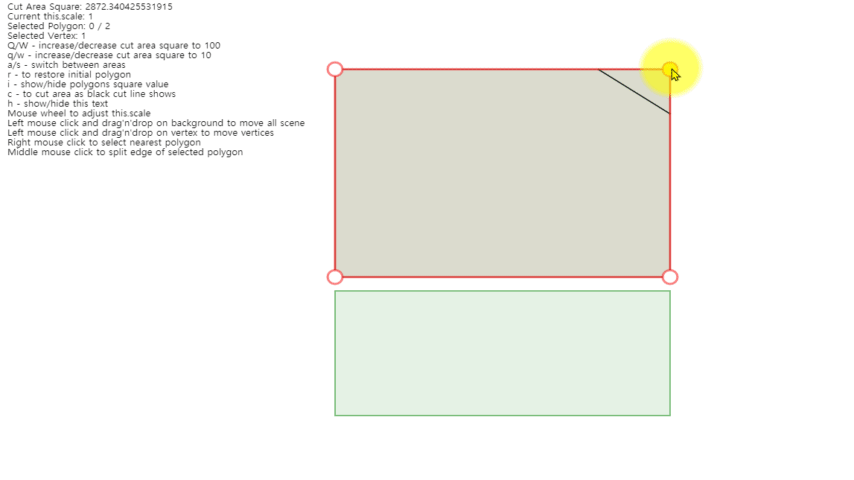

# poly-split-js
Solving the problem of cutting a given polygon into any number of areas of given squares with a lines of minimal length

## Synopsis
Polygon split for javscript/html5 canvas.

original cpp and Qt Source is https://github.com/dhmhd/poly-split

original algorithm: http://www.khetarpal.org/polygon-splitting/

## live demo
http://chisquare88.github.io/poly-split-js-es6/demo.html



## run
In the project directory, you can run:

### npm method
```shell
$ npm i
$ npm run start
```

### yarn method
```shell
$ yarn
$ yarn start
```


## Licence
Licensed under the MIT license.
